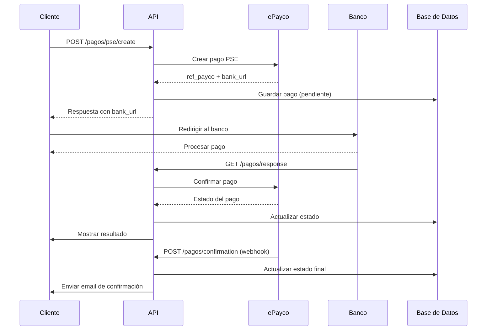

# API de Pagos PSE con ePayco - Documentación

## Descripción General

Esta documentación describe los endpoints disponibles para el procesamiento de pagos PSE utilizando la integración con ePayco. El sistema permite crear pagos, consultar estados y manejar confirmaciones de manera automática.

## Base URL

```
https://yourdomain.com/api/pagos
```

## Autenticación

Todos los endpoints requieren autenticación JWT. Incluya el token en el header:

```
Authorization: Bearer <your_jwt_token>
```

## Endpoints Disponibles

### 1. Crear Pago PSE

**POST** `/pse/create`

Crea un nuevo pago PSE para una factura específica.

#### Request Body

```json
{
    "factura_id": 123,
    "city": "Bogotá",
    "address": "Calle 123 #45-67"
}
```

#### Parámetros

| Campo | Tipo | Requerido | Descripción |
|-------|------|-----------|-------------|
| `factura_id` | integer | ✅ | ID de la factura a pagar |
| `city` | string | ❌ | Ciudad del pagador (default: "Bogotá") |
| `address` | string | ❌ | Dirección del pagador |

#### Response

```json
{
    "pago_id": 456,
    "ref_payco": "123456789",
    "bank_url": "https://bank.example.com/payment/123456789",
    "bank_name": "Banco de Bogotá",
    "status": "pendiente",
    "message": "Pago PSE creado exitosamente. Redirigir al banco para completar el pago."
}
```

#### Códigos de Respuesta

- `200` - Pago creado exitosamente
- `400` - Error en los datos enviados
- `404` - Factura no encontrada
- `500` - Error interno del servidor

---

### 2. Formulario de Pago PSE

**GET** `/pse/create/{factura_id}`

Muestra un formulario HTML para crear pagos PSE.

#### Parámetros de URL

| Campo | Tipo | Requerido | Descripción |
|-------|------|-----------|-------------|
| `factura_id` | integer | ✅ | ID de la factura |

#### Response

Retorna una página HTML con:
- Información de la factura
- Formulario para datos del pago
- JavaScript para procesar el pago

---

### 3. Respuesta del Banco

**GET** `/response`

Maneja la respuesta del banco después del pago PSE.

#### Query Parameters

| Campo | Tipo | Requerido | Descripción |
|-------|------|-----------|-------------|
| `ref_payco` | string | ✅ | Referencia de ePayco |
| `x_response` | string | ✅ | Respuesta del banco |
| `x_response_reason_text` | string | ✅ | Mensaje de respuesta |

#### Response

Retorna una página HTML con:
- Estado del pago
- Detalles de la transacción
- Enlaces para continuar

---

### 4. Confirmación de ePayco

**POST** `/confirmation`

Webhook para confirmaciones automáticas de ePayco.

#### Request Body (Form Data)

```
ref_payco=123456789&x_response=Aceptada&x_response_reason_text=Transaccion exitosa
```

#### Response

```json
{
    "status": "success",
    "message": "Confirmación procesada"
}
```

---

### 5. Consultar Estado de Pago

**GET** `/{pago_id}/status`

Consulta el estado actual de un pago específico.

#### Parámetros de URL

| Campo | Tipo | Requerido | Descripción |
|-------|------|-----------|-------------|
| `pago_id` | integer | ✅ | ID del pago |

#### Response

```json
{
    "pago_id": 456,
    "estado": "completado",
    "ref_payco": "123456789",
    "response_code": "Aceptada",
    "response_message": "Transaccion exitosa",
    "bank_name": "Banco de Bogotá",
    "bank_url": "https://bank.example.com/payment/123456789"
}
```

---

### 6. Listar Pagos

**GET** `/`

Lista los pagos del usuario actual.

#### Query Parameters

| Campo | Tipo | Requerido | Descripción |
|-------|------|-----------|-------------|
| `skip` | integer | ❌ | Número de registros a omitir (default: 0) |
| `limit` | integer | ❌ | Número máximo de registros (default: 100) |

#### Response

```json
[
    {
        "id": 456,
        "monto": 150000.00,
        "fecha_pago": "2024-10-22T15:30:00",
        "estado": "completado",
        "metodo_pago": "PSE",
        "ref_payco": "123456789",
        "bank_name": "Banco de Bogotá",
        "response_code": "Aceptada"
    }
]
```

---

### 7. Actualizar Pago

**PUT** `/{pago_id}`

Actualiza un pago existente (solo campos permitidos).

#### Request Body

```json
{
    "observaciones": "Pago procesado correctamente"
}
```

#### Response

```json
{
    "id": 456,
    "monto": 150000.00,
    "fecha_pago": "2024-10-22T15:30:00",
    "estado": "completado",
    "metodo_pago": "PSE",
    "observaciones": "Pago procesado correctamente",
    "ref_payco": "123456789",
    "bank_name": "Banco de Bogotá",
    "response_code": "Aceptada",
    "factura_id": 123
}
```

## Estados de Pago

| Estado | Descripción |
|--------|-------------|
| `pendiente` | Pago iniciado, esperando confirmación |
| `procesando` | Pago en proceso en el banco |
| `completado` | Pago exitoso |
| `fallido` | Pago rechazado |
| `cancelado` | Pago cancelado por el usuario |

## Notificaciones por Email

El sistema envía automáticamente notificaciones por email según el estado del pago:

### 1. Pago Pendiente
- **Asunto**: "Pago Pendiente - Factura #123"
- **Contenido**: Instrucciones para completar el pago
- **Template**: `payment_pending.html`

### 2. Pago Confirmado
- **Asunto**: "Pago Confirmado - Factura #123"
- **Contenido**: Confirmación de pago exitoso
- **Template**: `payment_confirmed.html`

### 3. Pago Fallido
- **Asunto**: "Pago Fallido - Factura #123"
- **Contenido**: Información sobre el fallo y próximos pasos
- **Template**: `payment_failed.html`

## Configuración Requerida

### Variables de Entorno

```env
# ePayco Configuration
EPAYCO_PUBLIC_KEY=your_public_key
EPAYCO_PRIVATE_KEY=your_private_key
EPAYCO_TEST_MODE=true
EPAYCO_MERCHANT_ID=your_merchant_id

# Email Configuration
SMTP_SERVER=smtp.gmail.com
SMTP_PORT=587
SMTP_USERNAME=your_email@gmail.com
SMTP_PASSWORD=your_app_password
FROM_EMAIL=noreply@biogenetic.com
FROM_NAME=BioGenetic

# URLs
BASE_URL=https://yourdomain.com
```

## Flujo de Pago PSE



## Códigos de Error Comunes

| Código | Descripción | Solución |
|--------|-------------|----------|
| `400` | Datos inválidos | Verificar formato de los datos enviados |
| `401` | No autorizado | Verificar token JWT |
| `404` | Recurso no encontrado | Verificar ID de factura/pago |
| `500` | Error interno | Contactar soporte técnico |

## Ejemplos de Uso

### Crear Pago PSE con cURL

```bash
curl -X POST "https://yourdomain.com/api/pagos/pse/create" \
  -H "Authorization: Bearer your_jwt_token" \
  -H "Content-Type: application/json" \
  -d '{
    "factura_id": 123,
    "city": "Bogotá",
    "address": "Calle 123 #45-67"
  }'
```

### Consultar Estado con cURL

```bash
curl -X GET "https://yourdomain.com/api/pagos/456/status" \
  -H "Authorization: Bearer your_jwt_token"
```

## Consideraciones de Seguridad

1. **HTTPS Obligatorio**: Todas las comunicaciones deben ser seguras
2. **Validación de Tokens**: Verificar JWT en cada request
3. **Validación de IP**: Verificar que webhooks vengan de ePayco
4. **Logs de Auditoría**: Registrar todas las transacciones
5. **Validación de Montos**: Verificar que los montos coincidan

## Soporte

Para soporte técnico o consultas sobre la API de pagos, contacte:

- **Email**: soporte@biogenetic.com
- **Teléfono**: +57 (1) 234-5678
- **Horario**: Lunes a Viernes, 8:00 AM - 6:00 PM
